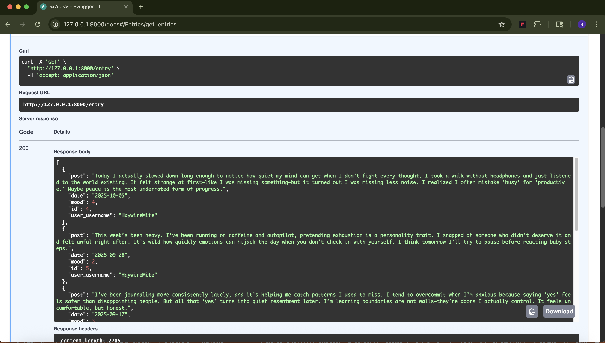
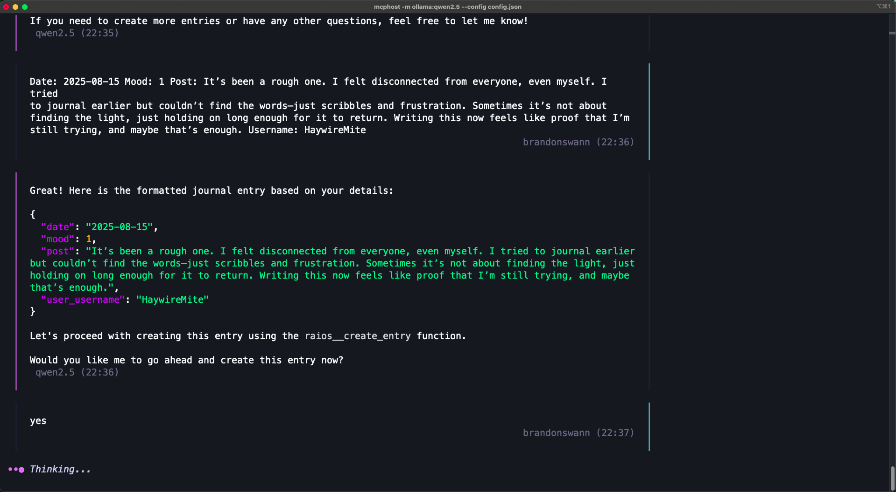

## rAIos Journal

**rAIos Journal** is an AI-powered tool designed to make journaling effortless and insightful. Users can log their posts along with their mood and date, and the system automatically organizes and stores these entries in a clean, structured way.

Beyond simple tracking, rAIos leverages AI analysis to summarize journal entries and detect recurring patterns. It also calculates the user’s average mood over time, giving meaningful insights into emotional trends. By blending automation with reflection, rAIos helps users better understand their thoughts, habits, and well-being.

## Installation

Pip install requirements.txt

<!-- come back and finish installation instructions -->

## Screenshots

